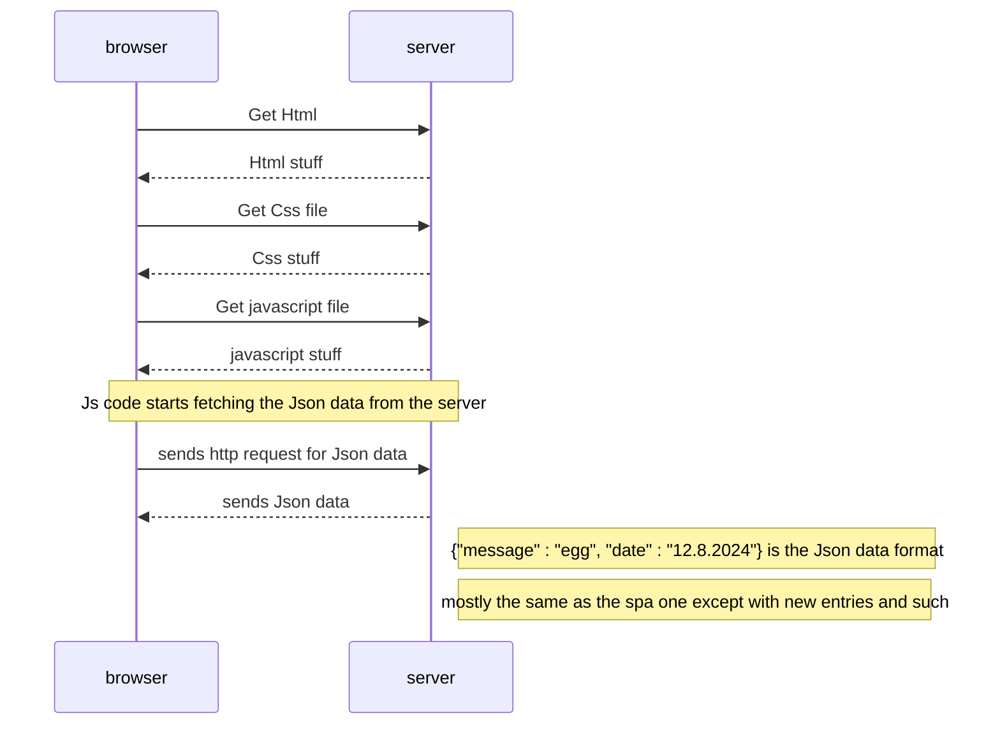

```mermaid
sequenceDiagram
  browser ->> server: Get Html
  server -->> browser: Html stuff
  browser ->> server: Get Css file
  server -->> browser: Css stuff
  browser ->> server: Get javascript file
  server -->> browser: javascript stuff
  note over server, browser: Js code starts fetching the Json data from the server
  browser ->> server: sends http request for Json data
  server -->> browser: sends Json data
  note right of server: {"message" : "egg", "date" : "12.8.2024"} is the Json data format
  note right of server: mostly the same as the spa one except with new entries and such
```
