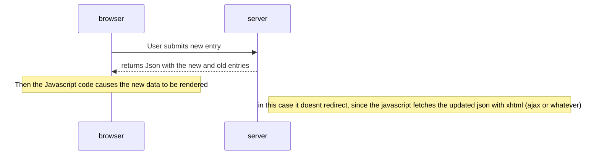

```mermaid
sequenceDiagram
  browser ->> server: User submits new entry
  server -->> browser: returns Json with the new and old entries
  note over browser: Then the Javascript code causes the new data to be rendered
  note right of server: in this case it doesnt redirect, since the javascript fetches the updated json with xhtml (ajax or whatever)
```
